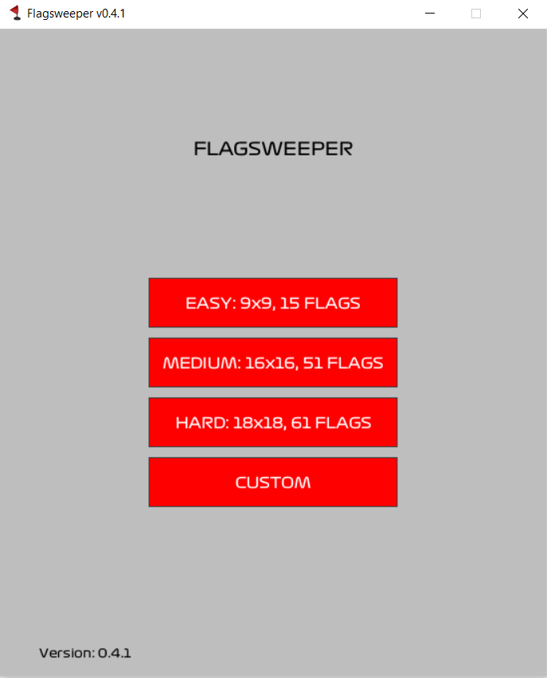
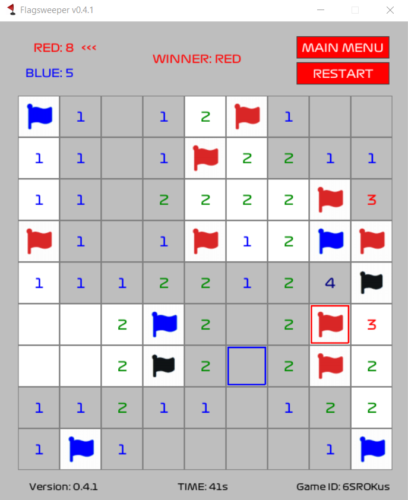

# Flagsweeper
- Multiplayer version of Minesweeper game we all know, written in Pygame library of Python.

## How to Play
- Due to multiplayer nature of the game, goal is not running away from mines but finding flags.
- Just left click to the tiles, nothing else is needed.
- Currently online playing isn't possible but you can play with someone next to you.

## Dependencies
- Written in Python 3.8.5, Pygame 2.0.1
- Works with Python 3.6+, Pygame 1.9.2+

## Running From Source Code
- `pip install pygame` if Pygame isn't installed.
- run [\_\_main\_\_.py](__main__.py) with Python.

## Download Executable
- Download latest version [here](https://github.com/opethef10/Flagsweeper/releases) (Windows only)  

## Screenshots
  
